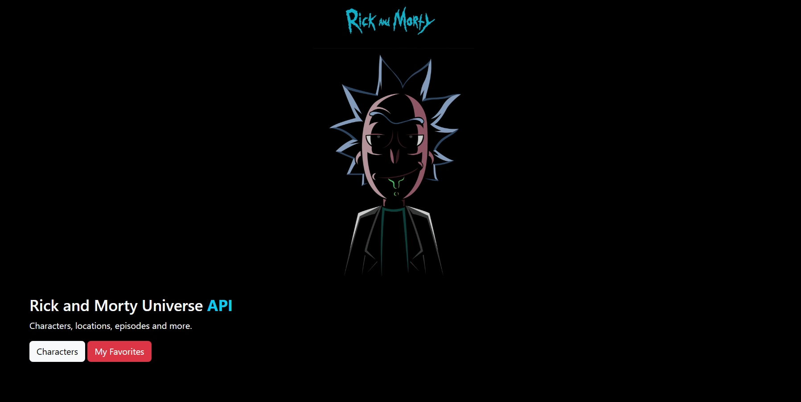
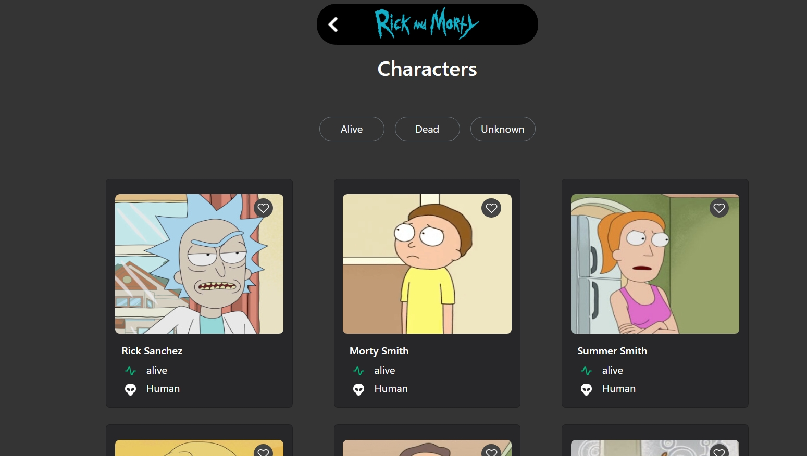

#  Rick and Morty Vanilla JavaScript SPA

A modern Single Page Application (SPA) built with **Vanilla JavaScript** that showcases characters from the Rick and Morty universe using the Rick and Morty API.

<div align="center">
  
  
</div>

## 📖 Description

This project demonstrates how to build a fully functional SPA without any frameworks, using only vanilla JavaScript and modern web APIs. The application features client-side routing, component-based architecture, state management, and a responsive user interface.

The app allows users to browse Rick and Morty characters, view detailed information, filter by status, navigate through paginated results, and maintain a personal favorites list with persistent storage.

## ✨ Features

### 🛣️ **Client-Side Routing**
- **History API Integration**: Seamless navigation without page reloads
- **Dynamic Routing**: Support for parameterized routes (`/character/:id`)
- **Programmatic Navigation**: Custom navigation system with `navigate()` function
- **Fallback Routes**: Wildcard routing for unmatched paths
- **Hash Routing Support**: Alternative routing strategy for better compatibility

### 🧩 **Component-Based Architecture**
- **Reusable Components**: Modular UI components (`CharacterCard`, `Pagination`, `FilterNav`)
- **Props Pattern**: Data passing between components
- **Event Delegation**: Efficient event handling
- **Separation of Concerns**: Clear distinction between pages and components

### 📡 **API Integration**
- **Rick and Morty API**: Full integration with external REST API
- **Async/Await**: Modern JavaScript for asynchronous operations
- **Error Handling**: Comprehensive try-catch blocks for robust error management
- **Loading States**: User-friendly loading indicators
- **Query Parameters**: Dynamic URL building for API requests

### 🎨 **User Interface**
- **Responsive Design**: Mobile-first approach with Bootstrap integration
- **Character Grid**: Dynamic character card layout
- **Pagination System**: Full-featured pagination with ellipsis and navigation
- **Status Filtering**: Filter characters by alive, dead, or unknown status
- **Favorites System**: Toggle and persist favorite characters

### 💾 **State Management**
- **LocalStorage Persistence**: Favorites persist across browser sessions
- **Page-Level State**: Individual state management for each route
- **State Restoration**: Automatic restoration of UI state on navigation
- **Filter State**: URL-based filter state management

### 🔄 **Modern JavaScript Features**
- **ES6+ Modules**: Import/export system for code organization
- **Template Literals**: Dynamic HTML generation
- **Destructuring**: Modern syntax for data extraction
- **Arrow Functions**: Concise function syntax
- **Async/Await**: Promise-based asynchronous programming

## 🏗️ Architecture

### **Routing System**
- **Declarative Route Configuration**: Routes defined in `routes.js`
- **Dynamic Route Matching**: Regex-based pattern matching for parameterized routes
- **History API**: Browser history manipulation for SPA navigation
- **CSS Loading**: Dynamic stylesheet loading per route

### **API Layer**
- **Fetch API**: Modern browser API for HTTP requests
- **URL Building**: Dynamic query parameter construction
- **Response Handling**: JSON parsing and error management
- **Loading States**: UI feedback during API calls

## 🛠️ Technologies Used

- **Vanilla JavaScript (ES6+)**: Core application logic
- **HTML5**: Semantic markup and structure
- **CSS3**: Styling with Flexbox and Grid
- **Bootstrap 5**: Responsive framework and UI components
- **Fetch API**: HTTP client for API communication
- **History API**: Browser navigation management
- **LocalStorage API**: Client-side data persistence
- **Rick and Morty API**: External data source

## 🚀 Getting Started

1. **Clone the repository**
   ```bash
   git clone https://github.com/yourusername/rick-morty-js.git
   cd rick-morty-js
   ```

2. **Install dependencies**
   ```bash
   npm install
   ```

3. **Serve the application**
   - Use a local server (Live Server, Python HTTP server, etc.)
   - Navigate to `script/index.html`

4. **Start exploring!**
   - Browse characters, view details, add favorites
   - Filter by status and navigate through pages

## 🎯 SPA Implementation Highlights

- **No Framework Dependencies**: Pure vanilla JavaScript implementation
- **Modern ES6+ Syntax**: Leveraging latest JavaScript features
- **Component Reusability**: Modular and maintainable code structure
- **Client-Side State**: Efficient state management without external libraries
- **Progressive Enhancement**: Works with and without JavaScript
- **SEO Considerations**: Hash routing fallback for better compatibility

## 📈 Performance Features

- **Lazy Loading**: Pages loaded on-demand
- **Event Delegation**: Efficient DOM event handling
- **Memory Management**: Proper cleanup and garbage collection
- **Optimized DOM Manipulation**: Minimal reflows and repaints

---
